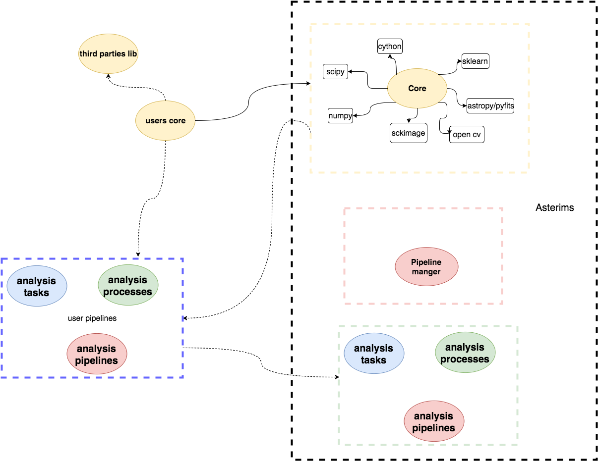

Overview of the Asetrims Project
================================
.. contents:: :local:

overview of the subpackages
---------------------------

Asterism provides five main subpackages:

* **core**: where the algorithms are implemented. This subpackage relies of well knows and robust library such as numpy scipy,
  open-CV, scikit-learn, scikit-image, astropy, and provides alghorithms regarding

    * clustering: clustring algorithms (dbscan/denclue/nn), and clusters characterization as detected sources
    * image processing (filters,geometric manipulation)
    * geometry: metrics and geometric manipulation
    * morphometry : shape measurements (invariants moments, statistical distributions of attractors)
    * photometry : basic photometric support
    * statistics: basis support for histograms and spatial 2D distribution (radial distributions etc...)

* **pipeline_manager**: this subpackage offers all the facilities to embed algorithms into tasks, to facilitate the developing
  of pipelines. The basic idea is that **task** provides a bridge between the **core** algorithms and the **pipeline manager**
  package. Tasks can be combined into processes and processes into pipelines (as shown in the blue-dashed box) and the
  **pipeline manager** will orchestrate all the data/work
  flow, together with the I/O and the configuration

* **analysis_tasks** subpackage contains implemented tasks

* **analysis_processes** subpackage contains implemented procesess

* **analysis_piepelines** subpackage contains implemented pipelines

The following diagram gives a schematic view of the packages relations.

.. image:: asterism_overview_fig1.png

deeper view of pipeline implementations
-------------------------------------------

The following diagram shows a more detailed view of the combination of the functional decomposition of pipeline in processes
and tasks. The **analysis tasks** package contains the implemented analysis tasks, a process can be composed from
any combination of tasks, and a pipeline can incorporate any combination of processes. The functional relation between
tasks in a process, and process in pipeline is implemented by a specific method.

users custom pipelines
----------------------

Users can:

    * develop their own tasks, processes, and pipelines
    * combine provided tasks in user defined processes
    * combine provided processes in user defined pipelines
    * develop their own core functionalities

