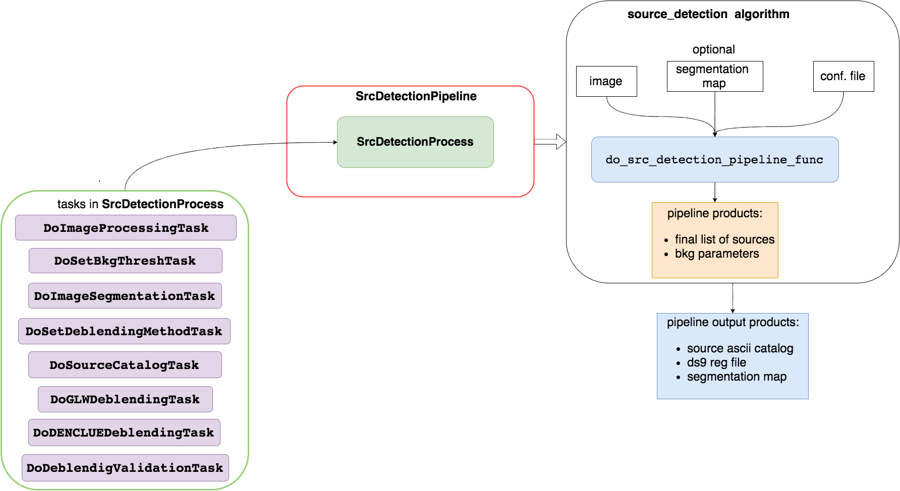

.. _src_detection_pipeline_user_guide:

src_detection pipeline user guide
=================================

.. contents:: :local:

.. toctree::

.. currentmodule:: asterism.analysis_pipelines.source_detection

Introduction
------------
This modules describe   the :class:`.SrcDetectionPipeline` class used to create the pipeline for the source detection.
The process in the pipeline are orchestrated by the :func:`.do_src_detection_pipeline_func`.

This pipeline has only one process:
    * :class:`~asterism.analysis_processes.source_detection.DoSrcDetectionProcess` (user guide: :ref:`src_detection_process_user_guide`)

    schematic view of the source detection pipeline

Full API
--------

A full API description of the processes can be found at

.. autosummary::
    ~asterism.analysis_processes.source_detection.DoSrcDetectionProcess

.. autosummary::
    ~asterism.analysis_processes.source_detection.do_src_detection_process_func

Processes userguide
-------------------
An accurate user guide of the processes can be found at:
    * :ref:`src_detection_process_user_guide`

Command line tutorial
---------------------

Python scripts tutorial
-----------------------

