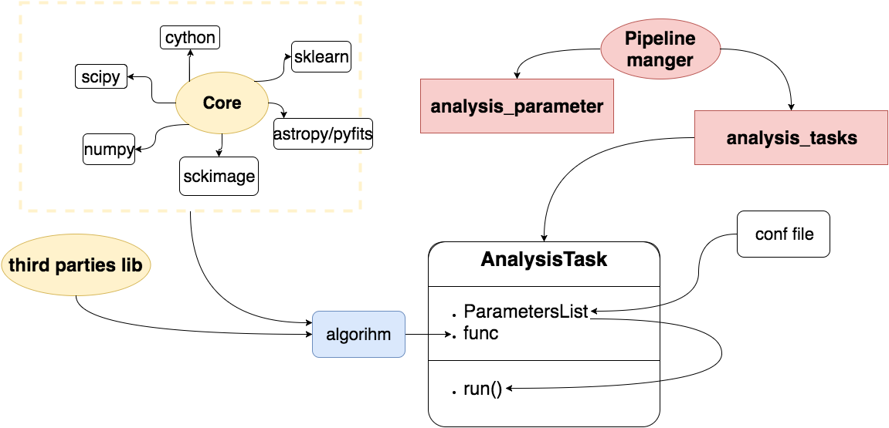

.. _task_user_guide:

.. currentmodule:: asterism.pipeline_manager.analysis_tasks
ASTErIsM analysis tasks
=======================
The :class:`AnalysisTask` implements an analysis tasks, that is an operation done by combination of functionalities provided by :mod:`asterism.core` package,
or by third party or user defined functionalities
   * The parameters are handled by the :class:`~asterism.pipeline_manager.analysis_parameters.ParametersList` class.
   * The :attr:`AnalysisTask.func` is linked to the function that implements the algorithm of the :class:`AnalysisTask`
   * The :meth:`AnalysisTask.run` method will run the :attr:`AnalysisTask.func` function, parsing the parameters
     either from a configuration file or by the argument of :meth:`AnalysisTask.run`.

Content
-------

.. toctree::
   :maxdepth: 1

      background estimation <source_detection/background_estimation.rst>
      image segmentation <source_detection/image_segmentation.rst>
      denclue deblending <source_detection/denclue_deblending.rst>
      denclue watershed deblending <source_detection/denclue_watershed_deblending.rst>
      gausslapce waterhed deblending <source_detection/glw_deblending.rst>
      deblending validation <source_detection/deblending_validation.rst>