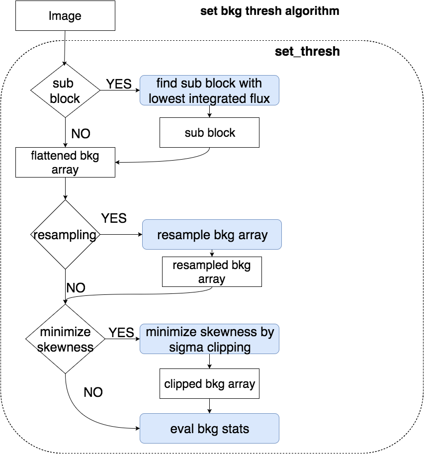

.. _bkg_estimation_task_user_guide:

DoSetBkgThresh
==============

.. contents:: :local:

.. toctree::

.. currentmodule:: asterism.analysis_tasks.source_detection.background_estimation.background_estimation

Introduction
------------
The :class:`~asterism.analysis_tasks.source_detection.background_estimation.background_estimation.DoSetBkgThreshTask` class implements
the  background estimation task.

Algorithm
---------
The algorithm is implemented in the
:func:`~asterism.analysis_tasks.source_detection.background_estimation.background_estimation.set_thresh` function.
Depending on the parameters passed as input, different strategies for the background estimation are followed.

Parameters
----------
* If ``sub_block_frac_size`` is provided, the image is partitioned in N-blocks with size=sub_block_frac_size*image,
  and the block with the lowest flux is used to estimate the bkg level. Otherwise, the full image is used.

* If ``skewness_range`` is provided, then the method is ste to the skewness is minimization. The skewness is minimized
  using the function :func:`~asterism.core.stats.utils.array_stats.minimize_skewness`. The data are clipped over the
  range :math:`|m-s1,m+s1|`,  where `m` is the mean of the data, and `s1=std(data)*sigma_range`.
  The data are clipped in the range providing the minimum skewness .

* If ``threshold`` is provided, then the backgorund level and the variance are directly evaluated from the background
  pixels

* If ``resampling_size`` the bkg is estimated from a random resampling of the full image (`sub_block_frac_size` is None) or
  of the sub image (`sub_block_frac_size` is not None). The resampling is performed only if the nubmber of pixels in
  the image is greater than `resampling_size`

* ``min_size_ratio`` provides the minimum size to stop the clipping, i.e. if **(clipped_size/full_size) <min_size_ratio**
  then the clipping process to minimize the skewness is stopped.

* ``n_std_th`` is used to set the background threshold according to **bkg_th=bkg_level+n_std_th * bkg_std** where:
     * ``bkg_std`` is evaluated from the median absolute deviation (MAD) (clipped or not according to method) of the background pixels
     * ``bkg_level`` is the mean of the of the background pixels (clipped or not according to method)

conf file section
-----------------
The configuration file section will read:

.. code-block:: none

     [ task: set_thresh: start]
        sub_block_frac_size = None
        min_size_ratio = 0.1
        n_std_th = 4.5
        resampling_size = 1000000
        skewness_range = 0.1
        plot = False
        verbose = False
     [ task: set_thresh: stop]

Accessing through the Task class
--------------------------------

.. code-block:: python

    from asterism import data_dir
    from asterism.core.image_manager.image import Image
    from asterism.analysis_tasks.source_detection.background_estimation.background_estimation import DoSetBkgThreshTask
    import pylab as plt

    fig,ax=plt.subplots(1,1)
    image=Image.from_fits_file(data_dir+'/galaxy.fits')
    ax.imshow(image._data,interpolation='nearest')

    bkg_task=DoSetBkgThreshTask()
    bkg_task.list_parameters()
    bkg_task.set_par('plot',value=True)
    bkg_task.set_par('skewness_range',value=0.1)
    bkg_task.set_par('sub_block_frac_size',value=0.1)
    bkg_task.list_parameters()
    bkg_threshold,bkg_mode,bkg_sig=bkg_task.run(image=image)

Direct access to set_thresh()
-------------------------------------------------------------------------------------------------------------------------

.. code-block:: python

    from asterism import data_dir
    from asterism.core.image_manager.image import Image
    from asterism.analysis_tasks.source_detection.background_estimation.background_estimation import set_thresh
    import pylab as plt

    fig,ax=plt.subplots(1,1)
    image=Image.from_fits_file(data_dir+'/galaxy.fits')
    ax.imshow(image._data,interpolation='nearest')

    bkg_threshold,bkg_mode,bkg_sig=set_thresh(image,sub_block_frac_size=0.1,skewness_range=0.1,plot=True)

