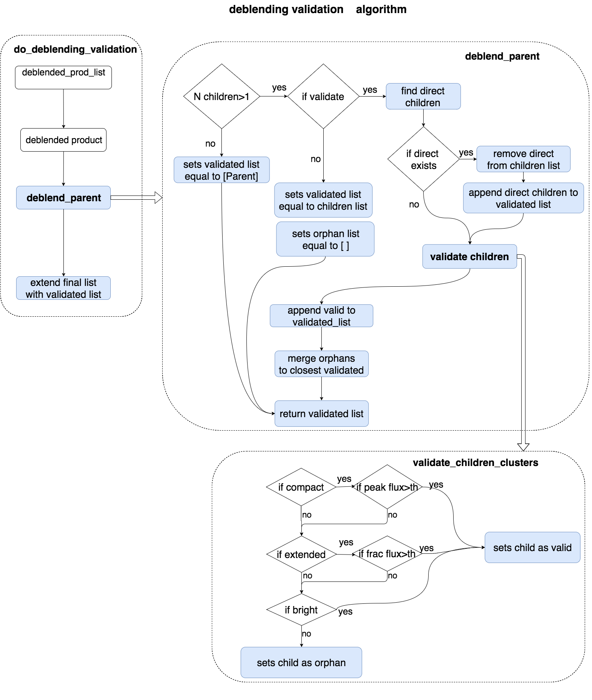

.. _deblending_validation_task_user_guide:

DoDeblendingValidation
======================

.. currentmodule:: asterism.analysis_tasks.source_detection.deblending.deblenging

.. contents:: :local:

.. toctree::

Introduction
------------

The :class:`DoDeblendingValidationTask` class implements
the  validation of the children clusters, i.e. the clusters produced by the partitioning of the parent cluster.

Algorithm
---------
The algorithm is implemented in the :func:`do_deblending_validation`   and :func:`deblend_parent`  :func:`validate_children_clusters` functions.

Paramters
---------
* ``validate_children``: if  True, then the resulting children sub-clusters are processed to be validated by the :func:`validate_children_clusters` that validates the sub-clusters, and returns the final list of accepted subclusters.
* ``children_compact_frac_size``: children to parent fractional size in pixels, below which the children is considered `compact`
* ``children_ext_frac_size``: children to parent fractional size in pixels, above which the children is considered `extended`
* ``children_bright_frac_peak_flux``: fractional peak flux of the children above which the children is considered `bright`.(Bright sources will be validated)
* ``children_min_frac_integ_flux``: min. val of the ratio of children to parent integ. flux, to validate an extended source children
* ``children_min_frac_peak_flux``: the minimum fractional peak flux to validate a compact source

conf file section
-----------------
The configuration file section will read:

.. code-block:: none

    [ task: deblending_validation: start]
        validate_children = False
        children_compact_frac_size = 0.1
        children_ext_frac_size = 0.1
        children_bright_frac_peak_flux = 0.1
        children_min_frac_integ_flux = 0.1
        children_min_frac_peak_flux = 0.1
        verbose = False
        plot = False
    [ task: deblending_validation: stop]

User guide
----------
.. toctree::
   :maxdepth: 3

