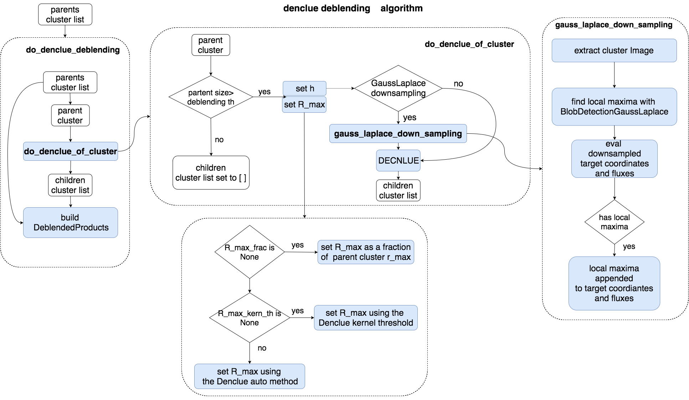

.. _denclue_deblending_task_user_guide:

DoDENCLUEDeblending
===================

.. currentmodule:: asterism.analysis_tasks.source_detection.deblending.denclue_deblending

.. contents:: :local:

.. toctree::

Introduction
------------
The :class:`DoDENCLUEDeblendingTask` class implements the  Denclue-based  deblending task.
The Denclue algorithm is used to move each pixel of the cluster to his attractor.
The final attractors are clusered by the DBSCAN algorithm. The parent cluster is
partitioned according to the clusters of attractors

Algorithm
---------
The algorithm is implemented in the :func:`do_denclue_deblending` and :func:`do_denclue_of_cluster` functions.

* The :func:`do_denclue_deblending` implements the top-level algorithm for the Denclue-based deblending:
    * Each parent cluster in the `cluster_list` is partitioned by the :func:`do_denclue_of_cluster` function.
    * The number of children clusters will be equal to the number of clusters of Denclue attractors.
    * The parent cluster with his children clusters are used to build the :class:`DeblendedProducts` object
    * a list of class:`DeblendedProducts` object is returned

* The actual parent cluster deblending is  implemented  in the  :func:`do_denclue_of_cluster` function:
    * The :func:`gauss_laplace_down_sampling` function implements the optional downsampling of the cluster image.
      It returns a downsampled array of target coordinates to use in the :class:`~asterism.core.clustering.density_based.denclue.DENCLUE` cluster partitioning.
    * The Denclue cluster segmentation is obtained using  the :class:`~asterism.core.clustering.density_based.denclue.DENCLUE`.

Parameters
----------
* ``gl_downsampling``:, if True, a GuassLaplace downsampling of the image is performed (to speed up the computation)
* ``h_grid``: grid  mesh in pixels for the downsampling
* ``gl_th_rel``: relative threshold for the GaussLaplace local maxima detection
* ``eps``: sets the stop threshold for the recursive attractor update rule
* ``digitize_attractors``: if True, will approximate the final attractor position to the coordinate of the closest image pixel
* ``k_table_size``: if not None, the kernel is precomputed in a look-up table over a grid with size equal to  `k_table_size`
* ``h_frac``: sets the width of the kernel as a fraction of the radius of the source to deblend
* ``h_min``: kernel width obtained by ``h_frac`` can not be lower than ``h_min``
* ``h_max``: kernel width obtained by ``h_frac`` can not be lerger than ``h_max``
* ``kernel``: sets the kernel for image convolution (gauss,uniform,logistic,etc...)
* ``h_frac``: sets the width of the kernel as `h=h_frac*sqrt(r_max^2+r_cluster^2)`
* ``h_min``: kernel width obtained by ``h_frac`` can not be lower than ``h_min``
* ``h_max``: kernel width obtained by ``h_frac`` can not be lerger than ``h_max``
* ``min_size``: sets the minimum size in pixels to perform a deblending
* ``mask_unchanged``: pixel whose attractors have moved to a final position with distance from the starting point less than    ``mask_unchanged``
  will be ignored, and lost in the final step
* ``attr_dbs_eps`` eps for dbscan of attractors
* ``attr_dbs_K`` K for dbscan of attractors
* ``R_max_frac``: sets max kernel influence radius as fraction of parent cluster r_max
* ``R_max_kern_th``: sets max kernel influence radius using the condition  R: kernel(R)<=th, with th relative to kernel max value
conf file section
-----------------
The configuration file section will read:

.. code-block:: none

    [ task: denclue_deblending: start]
        eps = 0.05
        digitize_attractors = False
        kernel = gauss
        k_table_size = None
        h_frac = 0.2
        h_min= 1.0
        h_max= None
        mask_unchanged = None
        min_size = 9
        attr_dbs_eps = 1.0
        attr_dbs_K = 4.0
        verbose = True
        plot = True
        # mex group: R_max_method
            R_max_frac = None
            R_max_kern_th = None
      [ task: denclue_deblending: stop]

User guide
----------
.. toctree::
   :maxdepth: 3

    denclue_deblending_example <denclue_deblending_example.rst>

