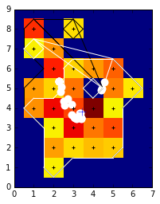

Accessing through the Task class
--------------------------------

loading image
~~~~~~~~~~~~~

.. code:: python

    import matplotlib.pyplot as plt
    %matplotlib inline  
    
    from asterism import data_dir
    from asterism.core.image_manager.image import Image
    from asterism.analysis_tasks.source_detection.background_estimation.background_estimation import DoSetBkgThreshTask
    from asterism.analysis_tasks.source_detection.image_segmentation.image_segmentation import DoImageSegmentationTask
    from asterism.analysis_tasks.source_detection.deblending.denclue_deblending import DoDENCLUEDeblendingTask
    import  numpy as np
    
    image=Image.from_fits_file(data_dir+'/deblending_img1.fits')

bkg estimation
~~~~~~~~~~~~~~

.. code:: python

    bkg_task=DoSetBkgThreshTask()
    bkg_task.list_parameters()
    bkg_task.set_par('plot',value=False)
    bkg_task.set_par('skewness_range',value=0.1)
    bkg_task.set_par('sub_block_frac_size',value=0.1)

.. parsed-literal::

    |-------------------------------------------------------
    |task: bkg_treshold
    |
    | par_name= sub_block_frac_size   value= 0.1   doc=  if provided, the bkg pixels are extracted from the sub-block with lowest integrated flux, having a size equal
                                              to sub_block_frac_size time the image size
    | par_name= min_size_ratio   value= 0.1   doc=  provides the minimum size to stop the clipping in the skewness minimization
    | par_name= n_std_th   value= 3.0   doc=  number of bakground deviation to set threshold, th=bkg_level+n_std_th*bkg_sig
    | par_name= resampling_size   value= 1000000   doc=  if the image pixels number>resampling_size,
                                                then a random resampling of pixels is performed, with a final number= resampling_size
    | par_name= skewness_range   value= 0.1   doc=  if not None, |skewness| is minimized in the range |bkg_lvl,bgk_lvl+skewness_range*bkg_std| 
    | par_name= plot   value= False   doc=  
    | par_name= verbose   value= False   doc=  set  verbosity on
    |-------------------------------------------------------

.. code:: python

    bkg_threshold,bkg_mode,bkg_sig=bkg_task.run(image=image)

.. parsed-literal::

    |------------------------------
    | Task: bkg_treshold Start
    |------------------------------
    |setting threshold
    |image flux min 0.0 image flux max 9.71633911133
    |using sub blocks
    |sub blocks grid built
    |sub block side 31
    |sub blocks Num 9
    |-
    |skewness minimization 961
    |flux bkg array  min,max 0.0886840820312 0.458374023438
    |minimization of |skewness|
    |initial skewness 0.160161054539
    |initial mean 0.250037394255
    |initial std 0.0593948364258
    |range of threshold for skewness minimization th_skew in [0.244098,0.255977]
    |start size:  961 0.250037394255 0.0593948364258 0.160161054539 961
    |min skewness=0.000577 for th_skew=0.062649
    |size ratio=0.706556, min_size ratio=0.100000
    |-
    |bkg_lvl 0.248482923269
    |bkg_std 0.0411071777344
    |bkg_th 0.371804456472
    0.371804456472 0.248482923269 0.0411071777344

image segmenetation
~~~~~~~~~~~~~~~~~~~

.. code:: python

    image_seg_task=DoImageSegmentationTask()
    image_seg_task.list_parameters()

.. parsed-literal::

    |-------------------------------------------------------
    |task: image_segmentation
    |
    | par_name= dbscan_buffer_size   value= None   doc=  size of the dbscan buffer
    | par_name= dbscan_eps   value= 1.5   doc=  eps dbscan par
    | par_name= method   value= dbscan_binned   doc=  method: dbscan or dbscan_binned, from_seg_map
    | par_name= verbose   value= False   doc=  set  verbosity on
    | par_name= plot_dbscan   value= False   doc=  plot dbscan
    | par_name= max_image_size   value= 1000000   doc=  
    | par_name= use_only_central_sub_stamp   value= False   doc=  None
    | par_name= min_sub_stamp_size   value= 25   doc=  
    | par_name= bkg_threshold   value= None   doc=  
    | par_name= K   value= None   doc=  density th for dbscan 
    | par_name= K_pix   value= False   doc=  density th per pixel for dbscan
    | par_name= seg_map_bkg_val   value= 0.0   doc=  
    |-------------------------------------------------------

.. code:: python

    image_seg_task.set_par('bkg_threshold',value=float(bkg_threshold))
    image_seg_task.set_par('K',value=1.5)
    image_seg_task.set_par('K_pix',value=True)
    image_seg_task.set_par('plot_dbscan',value=True)

.. code:: python

    image_seg_task.list_parameters()
    
    clusters_list,K,selected_coords=image_seg_task.run(image=image)

.. parsed-literal::

    |-------------------------------------------------------
    |task: image_segmentation
    |
    | par_name= dbscan_buffer_size   value= None   doc=  size of the dbscan buffer
    | par_name= dbscan_eps   value= 1.5   doc=  eps dbscan par
    | par_name= method   value= dbscan_binned   doc=  method: dbscan or dbscan_binned, from_seg_map
    | par_name= verbose   value= False   doc=  set  verbosity on
    | par_name= plot_dbscan   value= True   doc=  plot dbscan
    | par_name= max_image_size   value= 1000000   doc=  
    | par_name= use_only_central_sub_stamp   value= False   doc=  None
    | par_name= min_sub_stamp_size   value= 25   doc=  
    | par_name= bkg_threshold   value= 0.371804456472   doc=  
    | par_name= K   value= 1.5   doc=  density th for dbscan 
    | par_name= K_pix   value= True   doc=  density th per pixel for dbscan
    | par_name= seg_map_bkg_val   value= 0.0   doc=  
    |-------------------------------------------------------
    |------------------------------
    | Task: image_segmentation Start
    |------------------------------
    |method dbscan_binned
    |K, 0.557706684708
    |bkg th 0.371804456472

.. image:: denclue_deblending_example_files/denclue_deblending_example_9_1.png

denclue deblending
~~~~~~~~~~~~~~~~~~

.. code:: python

    deblendig=DoDENCLUEDeblendingTask()
    deblendig.list_parameters()

.. parsed-literal::

    |-------------------------------------------------------
    |task: denclue_deblending
    |
    | par_name= do_denclue_deblending   value= False   doc=  if True, the denclue deblending is performed
    | par_name= gl_downsampling   value= False   doc=  plot 
    | par_name= eps   value= 0.01   doc=  eps dbscan par
    | par_name= digitize_attractors   value= False   doc=  digitize attarctors 
    | par_name= kernel   value= gauss   doc=  smoothing  kernel
    | par_name= k_table_size   value= None   doc=  if>0 a lookup table of the kernel is used
    | par_name= h_frac   value= 0.2   doc=  kernel width as a fraction of parent cluster radius
    | par_name= h_min   value= 1.0   doc=  minim width of the kernel
    | par_name= mask_unchanged   value= None   doc=  th value to flag and attractor as unchanged
    | par_name= min_size   value= 9   doc=  minimum size in pixels,  of cluster to deblend
    | par_name= attr_dbs_eps   value= 1.0   doc=  eps for dbscan of attractors
    | par_name= attr_dbs_K   value= 4.0   doc=  K for dbscan of attractors
    | par_name= validate_children   value= False   doc=  plot 
    | par_name= children_min_frac_integ_flux   value= 0.1   doc=  min. ratio of children ot parent integ. flux
    | par_name= children_min_frac_peak_flux   value= 0.1   doc=  min. ratio of children ot parent peak flux
    | par_name= children_compact_frac_size   value= 0.1   doc=  min. ratio for compact children
    | par_name= children_ext_frac_size   value= 0.1   doc=  min. ratio for extended children
    | par_name= verbose   value= False   doc=  set  verbosity on
    | par_name= plot   value= False   doc=  plot 
    +--mex group: R_max_method
       x par_name= R_max_frac   value= None   doc=  max kernel influence radius as fraction of parent cluster r_max
       x par_name= R_max_kern_th   value= None   doc=  max kernel influence radius when kernel<=th with th relative to kenerl max value
    |-------------------------------------------------------

.. code:: python

    deblendig.set_par('do_denclue_deblending',value=True)
    deblendig.set_par('gl_downsampling',value=False)
    deblendig.set_par('h_frac',value=0.1)
    deblendig.set_par('plot',value=True)
    deblendig.set_par('verbose',value=True)

.. code:: python

    deblendig.run(clusters_list=clusters_list)

.. parsed-literal::

    |------------------------------
    | Task: denclue_deblending Start
    |------------------------------
    |-
    |debelnding for cluster 0 r_cluter 9.10082669322 r_max 16.8050178165
    |eps 0.01
    |h 1.91110876276
    |denclue
    |R_max [ 9.19206967]
    |running denclue with
    |kernel  gauss
    |h  1.91110876276
    |eps 0.01
    |R_max set to [ 9.19206967]
    | find attractors
    |position array size  470
    |target position array size  470
    |comp. time 0.351810216904
    |denclue done
    |dbs cl=0, x_c=16.478850, y_c=13.835445
    |dbs cl=1, x_c=6.880669, y_c=21.850691

.. image:: denclue_deblending_example_files/denclue_deblending_example_13_1.png

.. parsed-literal::

    | analysing sub clusters for parent cluster 0
    ->ID, 0 0 70.0 57.0
    ->ID, 1 1 56.0 57.0
    | children  clusters validated 2
    |-

.. parsed-literal::

    |-
    |debelnding for cluster 1 r_cluter 4.66908942296 r_max 8.69104489385
    |eps 0.01
    |h 1.0
    |denclue
    |R_max [ 4.80980981]
    |running denclue with
    |kernel  gauss
    |h  1.0
    |eps 0.01
    |R_max set to [ 4.80980981]
    | find attractors
    |position array size  101
    |target position array size  101
    |comp. time 0.204625844955
    |denclue done
    |dbs cl=0, x_c=7.587454, y_c=8.303403

.. image:: denclue_deblending_example_files/denclue_deblending_example_13_5.png

.. parsed-literal::

    |-

.. image:: denclue_deblending_example_files/denclue_deblending_example_13_7.png

.. parsed-literal::

    |-
    |debelnding for cluster 2 r_cluter 2.40607019623 r_max 4.11627970058
    |eps 0.01
    |h 1.0
    |denclue
    |R_max [ 4.80980981]
    |running denclue with
    |kernel  gauss
    |h  1.0
    |eps 0.01
    |R_max set to [ 4.80980981]
    | find attractors
    |position array size  27
    |target position array size  27
    |comp. time 0.026636838913
    |denclue done
    |dbs cl=0, x_c=3.068918, y_c=4.376034

.. image:: denclue_deblending_example_files/denclue_deblending_example_13_9.png

.. parsed-literal::

    |-

.. image:: denclue_deblending_example_files/denclue_deblending_example_13_11.png

.. parsed-literal::

    |N final clusters= 4

.. parsed-literal::

    [<asterism.core.clustering.source_cluster.SourceCluster2Dim at 0x117a83850>,
     <asterism.core.clustering.source_cluster.SourceCluster2Dim at 0x11705cf10>,
     <asterism.core.clustering.source_cluster.SourceCluster2Dim at 0x116804290>,
     <asterism.core.clustering.source_cluster.SourceCluster2Dim at 0x117796450>]

Accessing directly the do\_denclue\_deblending()
------------------------------------------------

.. code:: python

    from asterism import data_dir
    from asterism.core.image_manager.image import Image
    from asterism.analysis_tasks.source_detection.background_estimation.background_estimation import set_thresh
    from asterism.analysis_tasks.source_detection.image_segmentation.image_segmentation import do_image_segmentation
    from asterism.analysis_tasks.source_detection.deblending.denclue_deblending import do_denclue_deblending
    
    image=Image.from_fits_file(data_dir+'/deblending_img1.fits')

.. code:: python

    bkg_threshold,bkg_mode,bkg_sig=set_thresh(image,sub_block_frac_size=0.1,skewness_range=0.1,plot=False)

.. parsed-literal::

    |setting threshold
    |image flux min 0.0 image flux max 9.71633911133
    |using sub blocks
    |sub blocks grid built
    |sub block side 31
    |sub blocks Num 9
    |-
    |skewness minimization 961
    |flux bkg array  min,max 0.0886840820312 0.458374023438
    |minimization of |skewness|
    |initial skewness 0.160161054539
    |initial mean 0.250037394255
    |initial std 0.0593948364258
    |range of threshold for skewness minimization th_skew in [0.244098,0.255977]
    |start size:  961 0.250037394255 0.0593948364258 0.160161054539 961
    |min skewness=0.000577 for th_skew=0.062649
    |size ratio=0.706556, min_size ratio=0.100000
    |-
    |bkg_lvl 0.248482923269
    |bkg_std 0.0411071777344
    |bkg_th 0.371804456472

.. code:: python

    clusters_list,K,selected_coords=do_image_segmentation(image,bkg_threshold,K=np.float_(1.5),K_pix=True,plot_dbscan=True)

.. parsed-literal::

    |method dbscan_binned
    |K, 0.557706684708
    |bkg th 0.371804456472

.. image:: denclue_deblending_example_files/denclue_deblending_example_17_1.png

denclue deblendings
~~~~~~~~~~~~~~~~~~~

.. code:: python

    do_denclue_deblending(clusters_list=clusters_list,do_denclue_deblending=True,gl_downsampling=True,h_frac=0.1,plot=True)

.. parsed-literal::

    |-
    |debelnding for cluster 0 r_cluter 9.10082669322 r_max 16.8050178165
    |downsampling start
    |local maxima [[16 15]
     [ 7 22]]
    |downsamplig done
    |denclue
    |R_max 9.10082669322
    |comp. time 0.203984022141
    |denclue done
    |dbs cl=0, x_c=15.725288, y_c=13.834126
    |dbs cl=1, x_c=7.494492, y_c=21.850731

.. image:: denclue_deblending_example_files/denclue_deblending_example_19_1.png

.. parsed-literal::

    ->ID, 0 0 69.0 57.0
    ->ID, 1 1 70.0 56.0
    | children  clusters validated 2
    |-

.. parsed-literal::

    |-
    |debelnding for cluster 1 r_cluter 4.66908942296 r_max 8.69104489385
    |downsampling start
    |local maxima [[ 7  9]
     [ 5 14]
     [10  2]]
    |downsamplig done
    |denclue
    |R_max 4.66908942296
    |comp. time 0.0675599575043
    |denclue done
    |dbs cl=0, x_c=6.874224, y_c=8.803077
    |dbs cl=1, x_c=11.464534, y_c=5.122089

.. image:: denclue_deblending_example_files/denclue_deblending_example_19_5.png

.. parsed-literal::

    ->ID, 0 0 49.0 76.0
    ->ID, 1 1 50.0 69.0
    | children  clusters validated 2
    |-

.. image:: denclue_deblending_example_files/denclue_deblending_example_19_7.png

.. parsed-literal::

    |-
    |debelnding for cluster 2 r_cluter 2.40607019623 r_max 4.11627970058
    |downsampling start
    |local maxima [[3 4]
     [1 8]
     [2 6]
     [5 6]]
    |downsamplig done
    |denclue
    |R_max 2.40607019623
    |comp. time 0.00781488418579
    |denclue done
    |dbs cl=0, x_c=3.434386, y_c=3.820863

.. parsed-literal::

    |-

.. image:: denclue_deblending_example_files/denclue_deblending_example_19_11.png

.. parsed-literal::

    |N final clusters= 5

.. parsed-literal::

    [<asterism.core.clustering.source_cluster.SourceCluster2Dim at 0x1177a5a90>,
     <asterism.core.clustering.source_cluster.SourceCluster2Dim at 0x1181e9190>,
     <asterism.core.clustering.source_cluster.SourceCluster2Dim at 0x1046ddfd0>,
     <asterism.core.clustering.source_cluster.SourceCluster2Dim at 0x118a28d10>,
     <asterism.core.clustering.source_cluster.SourceCluster2Dim at 0x117694350>]

