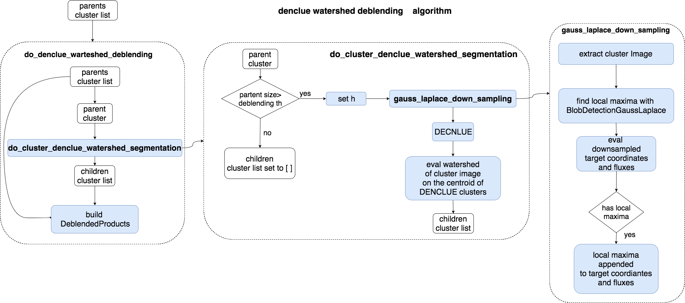

.. _denclue_watershed_deblending_task_user_guide:

DoDENCLUEWatershedDeblending
===================

.. currentmodule:: asterism.analysis_tasks.source_detection.deblending.denclue_watershed_deblending

.. contents:: :local:

.. toctree::

Introduction
------------
The :class:`DoDENCLUEWatershedDeblendingTask` class implements the  Denclue+Watershed  deblending task.

Algorithm
---------
The algorithm is implemented in the :func:`do_denclue_watershed_deblending` and :func:`do_cluster_denclue_watershed_segmentation` functions.

* The :func:`do_denclue_watershed_deblending` implements the top-level algorithm for the DenclueWatershed deblending:
    * Each parent cluster in the `cluster_list` is partitioned by the :func:`do_denclue_of_cluster` function.
    * The number of children clusters will be equal to the number of clusters of Denclue attractors.
    * The parent cluster with his children clusters are used to build the :class:`DeblendedProducts` object
    * a list of class:`DeblendedProducts` object is returned

* The actual parent cluster deblending is  implemented  in the  :func:`do_cluster_denclue_watershed_segmentation` function:
    * The :func:`gauss_laplace_down_sampling` function implements the optional downsampling of the cluster image.
      It returns a downsampled array of target coordinates to use in the :class:`~asterism.core.clustering.density_based.denclue.DENCLUE` cluster partitioning.
    * The Denclue cluster segmentation is obtained using  the :class:`~asterism.core.clustering.density_based.denclue.DENCLUE`.

Parameters
----------
* ``kernel``: sets the kernel for image convolution (gauss,uniform,logistic,etc...)
* ``gl_th_rel``: relative threshold for the GaussLaplace local maxima detection
* ``h_frac``: sets the width of the kernel as `h=h_frac*sqrt(r_max^2+r_cluster^2)`
* ``eps``: sets the stop threshold for the recursive attractor update rule
* ``h_min``: kernel width obtained by ``h_frac`` can not be lower than ``h_min``
* ``h_grid``: grid  mesh in pixels for the downsampling
* ``attr_dbs_eps`` eps for dbscan of attractors
* ``attr_dbs_K`` K for dbscan of attractors
* ``min_size`` minimum cluster size in pixels, to be deblended

conf file section
-----------------
The configuration file section will read:

.. code-block:: none

    [ task: denclue_deblending: start]
        gl_th_rel = 0.1
        kernel = gauss
        eps = 0.01
        h_frac = 0.2
        h_min = 1.0
        h_grid = 3
        attr_dbs_eps = 1.0
        attr_dbs_K = 4.0
        min_size = 9
        verbose = False
        plot = False
    [ task: denclue_deblending: stop]

User guide
----------
.. toctree::
   :maxdepth: 3

    denclue_deblending_example <denclue_deblending_example.rst>

