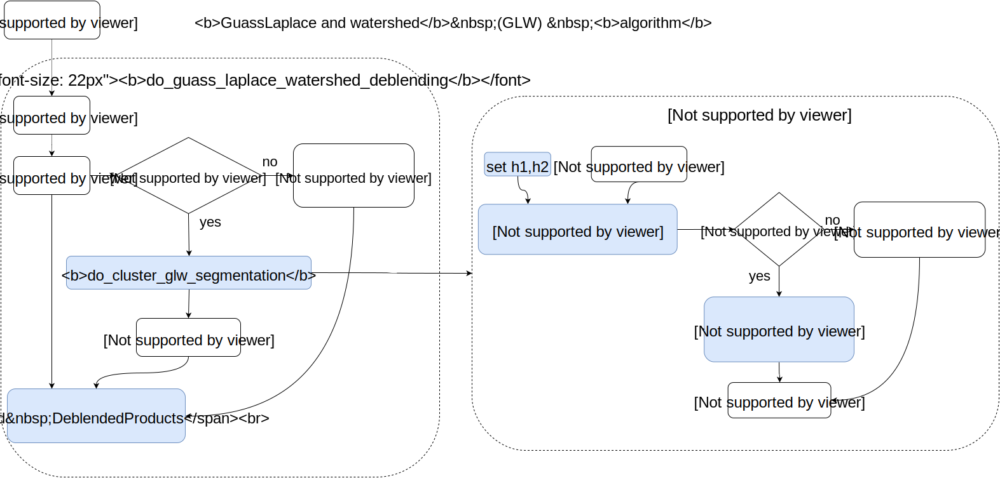

.. _glw_deblending_task_user_guide:

DoGLWDeblending
===============

.. currentmodule:: asterism.analysis_tasks.source_detection.deblending.glw_deblending

.. contents:: :local:

.. toctree::

Introduction
------------
The :class:`DoGLWDeblendingTask` class implements the  Laplacian of Gaussian maxim plus Watershed  deblending task.
The Laplacian of Gaussian method is used to find the local maxima, and the Watershed method is used to
segment the cluster in the basins identified by the local maxima

Algorithm
----------

The algorithm is implemented in the :func:`do_guass_laplace_watershed_deblending` and :func:`do_cluster_glw_segmentation` functions

* The :func:`do_guass_laplace_watershed_deblending` implements the top level  algorithm for the guass_laplace_watershed_deblending:
        * each parent cluster in the `cluster_list` is partitioned by the :func:`do_cluster_glw_segmentation` function.
        * the parent cluster with his children clusters are used to build :class:`DeblendedProducts` object
        * a list of class:`DeblendedProducts` objects is returned
* The actual parent cluster deblending is  implemented  in the  :func:`do_cluster_glw_segmentation` function:
    * The  local maxima are obtained by the (:class:`~asterism.core.image_processing.features.BlobDetectionGaussLaplace`) class
    * The watershed segmentation on the corresponding local maxima is done using the :func:`~skimage.morphology.watershed.watershed` function

Parameters
----------
* ``h_frac``: sets the width of the kernel as `h=h_frac*sqrt(r_max^2+r_cluster^2)`
* ``h_min``: kernel width obtained by ``h_frac`` can not be lower than ``h_min``
* ``gl_th_rel``: relative threshold for the GaussLaplace local maxima detection
* ``min_size``: sets the minimum size in pixels to perform a deblending

conf file section
-----------------
.. code-block:: none

    [ task: glw_deblending: start]
        h_frac = 0.25
        h_min = 1.0
        gl_th_rel = 0.1
        min_size = 9
        verbose = False
        plot = False
    [ task: glw_deblending: stop]

User guide
----------
.. toctree::
   :maxdepth: 3

