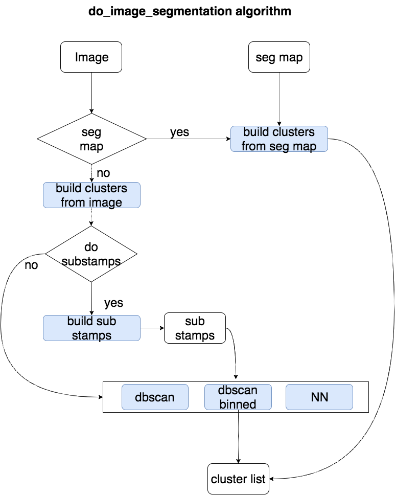

.. _image_segmentation_task_user_guide:

DoImageSegmentation
===================

.. currentmodule:: asterism.analysis_tasks.source_detection.image_segmentation.image_segmentation

.. contents:: :local:

.. toctree::

Algorithm
---------
The :class:`~ImageSegmentationTask` class implements
the  image segmentation task. The algorithm is implemented in the :func:`do_image_segmentation` function.
Depending on the parameters passed as input, different strategies for the image segmentation are followed.

Parameters
----------
* ``method`` sets the segmentation method
    * 'dbscan' : the dbscan method is used
    * 'dbscan_binned' the binned dbscan method is used(default)
    * 'connected' the nearest neighbor method is used
* ``bkg_threshold``: the value of estimated background threshold . All the points below this value are masked
  (** not present in conf file because this value in the process is determined by the bkg task**)
* ``K``: sets the segmentation threshold as `K*bkg_threshold`
* ``K_pix``: if True,  total flux in the dbscan bursh is divided by the number of pixels in the brush, and the compared to K*bkg_threshold
* ``dbscan_eps``: the scanning brush radius for the dbscan. (In the case of binned, it is the size of the scanning box)
* ``seg_map_bkg_val``: value for the bkg pixels in the seg map (default 0)
* ``max_image_size``:  if is not None, the image is segmented in substamps, according to `bkg_threshold`
* ``min_sub_stamp_size``:   the minimum substamp size, if smaller the sub stamp will be rejected
* ``input_seg_map``: a 2dim numpy array  storing the segmentation map. In this case the segmentation will come directly from the seg_map (** in the do_IO_conf section of the conf file **)
* ``use_only_central_sub_stamp``: if True, only the central source is returned

conf file section
-----------------
The configuration file section will read:
.. code-block::

    [ task: image_segmentation: start]
        method = dbscan_binned
        K = 1.5
        K_pix = False
        dbscan_eps = 1.0
        seg_map_bkg_val = 0
        verbose = False
        plot = False
        max_image_size = 1000000
        use_only_central_sub_stamp = False
        min_sub_stamp_size = 25
    [ task: image_segmentation: stop]

Accessing through the Task class
--------------------------------

.. code-block:: python

    from asterism import data_dir
    from asterism.core.image_manager.image import Image
    from asterism.analysis_tasks.source_detection.background_estimation.background_estimation import DoSetBkgThreshTask
    from asterism.analysis_tasks.source_detection.image_segmentation.image_segmentation import DoImageSegmentationTask
    import  numpy as np

    image=Image.from_fits_file(data_dir+'/galaxy.fits')

    bkg_task=DoSetBkgThreshTask()
    bkg_task.list_parameters()
    bkg_task.set_par('plot',value=False)
    bkg_task.set_par('skewness_range',value=0.1)
    bkg_task.set_par('sub_block_frac_size',value=0.1)

    bkg_threshold,bkg_mode,bkg_sig=bkg_task.run(image=image)
    image_seg_task=DoImageSegmentationTask()
    image_seg_task.list_parameters()
    image_seg_task.set_par('bkg_threshold',value=float(bkg_threshold))
    image_seg_task.set_par('K',value=1.5)
    image_seg_task.set_par('K_pix',value=True)
    image_seg_task.set_par('plot_dbscan',value=True)
    image_seg_task.list_parameters()

    image_seg_task.run(image=image)

Direct access to do_image_segmentation()
-------------------------------------------------------------------------------------------------------------------------

.. code-block:: python

    from asterism import data_dir
    from asterism.core.image_manager.image import Image
    from asterism.analysis_tasks.source_detection.background_estimation.background_estimation import set_thresh
    from asterism.analysis_tasks.source_detection.image_segmentation.image_segmentation import do_image_segmentation

    image=Image.from_fits_file(data_dir+'/galaxy.fits')
    bkg_threshold,bkg_mode,bkg_sig=set_thresh(image,sub_block_frac_size=0.1,skewness_range=0.1,plot=False)
    do_image_segmentation(image,bkg_threshold=bkg_threshold,K=np.float_(1.5),K_pix=True,plot_dbscan=True)

